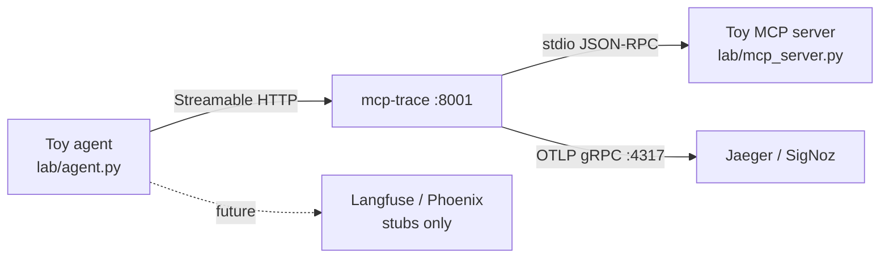

# agent-obs-lab

[](https://github.com/anhermon/agent-obs-lab/actions/workflows/ci.yml)
[](LICENSE)

Hands-on **agent observability** lab — traces + evals + blog drafts.

Ship a usable skeleton: a toy multi-tool agent, [mcp-trace](https://github.com/anhermon/mcp-trace) instrumentation exporting OpenTelemetry spans, optional Jaeger via Docker Compose, and stub notes for Langfuse / Phoenix. Blog posts are **draft outlines only** (no fake live posts).

## Goals (1–2 week MVP)

- See every MCP `tools/call` as an OTel span (timing, ok/error).
- Run locally with light deps (Python stdlib agent + server).
- Optional Jaeger (or SigNoz) backend via Compose / OTLP.
- Stub wiring for Langfuse and Phoenix (env vars + where signals go).
- Draft blog outlines under `docs/blog/` for instrumenting and evaluating from traces.

**Out of MVP:** gateway mesh, monetization, deep custom OTel semantic conventions.

## Architecture



| Piece | Role | Status |
|-------|------|--------|
| `lab/mcp_server.py` | stdio MCP server — `get_weather`, `calculate`, `lookup_faq` | **Working** |
| `lab/agent.py` | Deterministic multi-tool turn (≥2 calls) via mcp-trace | **Working** (needs proxy up) |
| [mcp-trace](https://github.com/anhermon/mcp-trace) | Transparent proxy → OTel spans | **Working** (install separately) |
| `docker compose` | Jaeger all-in-one with OTLP | **Working** (optional) |
| Langfuse / Phoenix | Env + docs stubs | **Stubbed** |
| `docs/blog/*` | Two draft outlines | **Drafts** |

## How to run locally

### Prerequisites

- Python 3.10+
- [Go](https://go.dev/dl/) 1.22+ (to install mcp-trace) **or** a prebuilt binary from [mcp-trace releases](https://github.com/anhermon/mcp-trace/releases)
- Docker (optional, for Jaeger)

### 1. Install mcp-trace

```bash
go install github.com/anhermon/mcp-trace/v2/cmd/mcp-trace@v2.0.3
# ensure $(go env GOPATH)/bin is on PATH
mcp-trace version
```

### 2. Start Jaeger (optional but recommended)

```bash
docker compose up -d
# UI: http://localhost:16686
```

### 3. Start the traced MCP server

```bash
./scripts/run-trace.sh
# listens on :8001, exports OTLP to localhost:4317, service.name=agent-obs-lab
```

### 4. Run the toy agent

```bash
python3 lab/agent.py
# failed-turn fixture for eval outline:
python3 lab/agent.py --fail-faq
```

You should see ≥2 tool calls (`get_weather`, `calculate`, plus `lookup_faq`). In Jaeger, select service **agent-obs-lab**.

One-shot reminder: `./scripts/run-local.sh`

### Dev / CI without the proxy

```bash
python3 -m venv .venv && source .venv/bin/activate
pip install -r requirements.txt
ruff check lab
pytest -q
```

## Repo layout

```
lab/                  Toy MCP server + agent + smoke tests
scripts/              run-trace.sh, run-local.sh
docker-compose.yml    Jaeger (OTLP)
docker/               Collector config (optional / future fan-out)
docs/blog/            Draft outlines (not published posts)
docs/integrations/    Langfuse, Phoenix, SigNoz stubs
.github/workflows/    Lint + pytest smoke
```

## Integrations (stubs)

- [Langfuse](docs/integrations/langfuse.md) — env vars + where spans/evals go
- [Phoenix](docs/integrations/phoenix.md) — OTLP endpoint notes
- [SigNoz](docs/integrations/signoz.md) — alternate OTLP backend

## Blog drafts

1. [Instrument an MCP tool call](docs/blog/01-instrument-mcp-tool-call.md)
2. [Eval a failed agent turn from a trace](docs/blog/02-eval-failed-agent-turn-from-trace.md)

## License

MIT — see [LICENSE](LICENSE).
