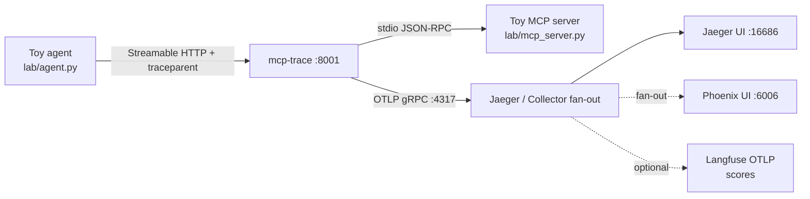
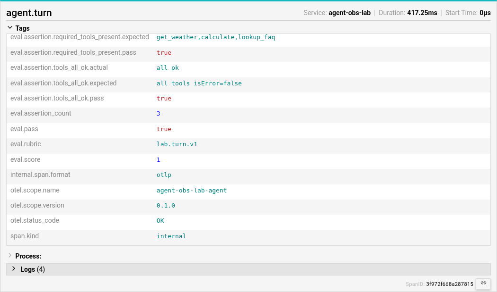
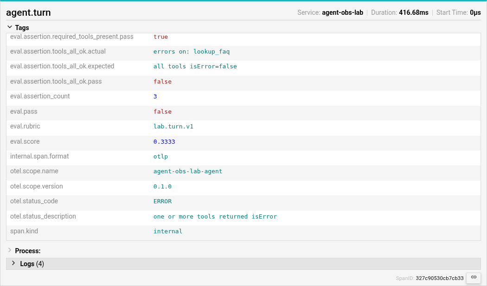
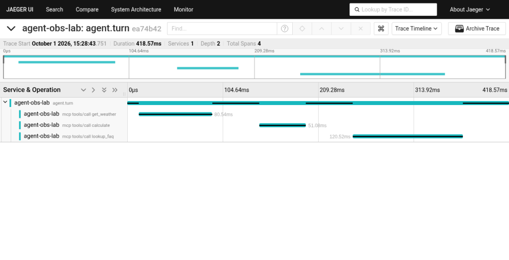
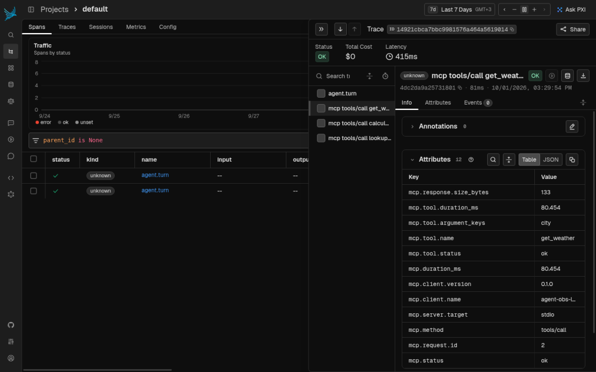

# agent-obs-lab

[](https://github.com/anhermon/agent-obs-lab/actions/workflows/ci.yml)
[](LICENSE)

Hands-on **agent observability** lab — traces + evals + blog drafts.

Ship a usable skeleton: a toy multi-tool agent, [mcp-trace](https://github.com/anhermon/mcp-trace) instrumentation exporting OpenTelemetry spans, optional Jaeger via Docker Compose (plus Collector fan-out to Phoenix), and Langfuse wiring notes for scores. Blog posts are **draft outlines only** (no fake live posts).

## Goals (1–2 week MVP)

- See every MCP `tools/call` as an OTel span (timing, ok/error), under one **turn-level** parent when possible — plus **eval** signals (pass/fail, score, rubric) on that parent, not only duration waterfalls.
- Run locally with light deps (Python stdlib agent + server).
- Optional Jaeger (or SigNoz) backend via Compose / OTLP; optional Collector → Phoenix (then Langfuse).
- Stub / Collector wiring for Langfuse and Phoenix (env vars + where signals go — **no dual-SDK in the toy agent**).
- Draft blog outlines under `docs/blog/` for instrumenting and evaluating from traces.

**Out of MVP:** gateway mesh, monetization, deep custom OTel semantic conventions.

## Architecture



| Piece | Role | Status |
|-------|------|--------|
| `lab/mcp_server.py` | stdio MCP server — `get_weather`, `calculate`, `lookup_faq` | **Working** |
| `lab/agent.py` | Deterministic multi-tool turn (≥2 calls) + `agent.turn` parent span | **Working** (needs proxy up) |
| `lab/eval.py` | Turn rubric → pass/fail, score, assertions on the span + JSON artifact | **Working** |
| [mcp-trace](https://github.com/anhermon/mcp-trace) | Transparent proxy → OTel spans | **Working** (install separately) |
| `docker compose` | Jaeger all-in-one with OTLP | **Working** (optional) |
| `docker-compose.fanout.yml` | Collector → Jaeger + Phoenix | **Working** (optional) |
| Langfuse | Collector exporter + docs (scores) | **Documented** (keys required) |
| `docs/blog/*` | Two draft outlines | **Drafts** |

## Evals demo

Turn rubric `lab.turn.v1` lands on the `agent.turn` span as Tags (`eval.pass`, `eval.score`, …). Expand Tags in Jaeger — the summary line truncates until expanded.

Happy path — `eval.score=1`, `eval.pass=true`:



Failed FAQ (`python3 lab/agent.py --fail-faq`) — `eval.score≈0.3333`, `eval.pass=false`:



Reproduce after [How to run locally](#how-to-run-locally); full waterfall + Phoenix shots are under [What you should see](#what-you-should-see).

## How to run locally

### Prerequisites

- Python 3.10+
- [mcp-trace](https://github.com/anhermon/mcp-trace) on `PATH` — **prefer a [release binary](https://github.com/anhermon/mcp-trace/releases)** (no Go required), or install with Go (see below)
- Docker (optional, for Jaeger / fan-out). The CLI and Compose plugin are **not** always present; see [Docker gotchas](#docker-gotchas-tcp-host-missing-cli--compose-plugin).

### 1. Install mcp-trace

**Option A — release binary (recommended, Go-free):**

```bash
# pick the asset for your OS/arch from:
# https://github.com/anhermon/mcp-trace/releases
mkdir -p ~/.local/bin
# example after download/extract:
install -m 0755 ./mcp-trace ~/.local/bin/mcp-trace
export PATH="$HOME/.local/bin:$PATH"
mcp-trace version   # expect v2.0.3+
```

**Option B — `go install` (put `GOPATH/bin` on PATH):**

```bash
go install github.com/anhermon/mcp-trace/v2/cmd/mcp-trace@v2.0.3
export PATH="$(go env GOPATH)/bin:$PATH"   # required — go install does not do this for you
mcp-trace version
```

### 2. Start backends

**Default (Jaeger with OTLP on the host):**

```bash
./scripts/run-local.sh
# or: docker compose up -d
# UI: http://localhost:16686
```

**Fan-out (Collector → Jaeger + Phoenix, still `:4317` for mcp-trace):**

```bash
./scripts/run-local.sh --fanout
# or: docker compose -f docker-compose.fanout.yml up -d --build
# Jaeger:  http://localhost:16686
# Phoenix: http://localhost:6006
```

Collector config is **baked into the image** (`docker/Dockerfile.otel-collector`) so `--fanout` works when `DOCKER_HOST` is TCP (host bind-mounts of the yaml resolve on the daemon FS and become empty dirs). `run-local.sh --fanout` also tears down the default Jaeger stack first and fails if the Collector container is not running — so a stale `:4317` listener cannot make the script exit 0.

**No Compose? `docker run` one-liner for Jaeger:**

```bash
docker run -d --name agent-obs-lab-jaeger \
  -e COLLECTOR_OTLP_ENABLED=true \
  -p 16686:16686 -p 4317:4317 -p 4318:4318 \
  jaegertracing/all-in-one:1.62.0
```

`./scripts/run-local.sh` uses this fallback automatically when the Compose plugin is missing.

### Docker gotchas (TCP host, missing CLI / Compose plugin)

| Symptom | Fix |
|---------|-----|
| `docker: command not found` | Install a Docker **client** (e.g. `apt install docker.io`) even if a daemon already runs elsewhere |
| `Cannot connect … unix:///var/run/docker.sock` | Daemon may be TCP-only: `export DOCKER_HOST=tcp://127.0.0.1:2375` |
| `docker compose` missing / Debian has no `docker-compose-v2` package | Install the [Compose plugin binary](https://github.com/docker/compose/releases) into `~/.docker/cli-plugins/docker-compose`, **or** use the `docker run` one-liner above |
| Fan-out Collector crash / empty `/etc/otelcol/config.yaml` under TCP `DOCKER_HOST` | Do **not** bind-mount the yaml; use the baked image (`up -d --build`). Prefer `./scripts/run-local.sh --fanout` |
| `--fanout` exited 0 but `:4317` is dead / wrong stack | Default Jaeger may still own the port. Re-run `./scripts/run-local.sh` (no flag) or `--fanout` — the script stops the other stack and asserts the Collector is running |

### 3. Start the traced MCP server

```bash
./scripts/run-trace.sh
# listens on :8001, exports OTLP to localhost:4317, service.name=agent-obs-lab
```

A startup **WARN** that OTLP is “not yet connected… spans will be lost silently” is **expected** until the first successful export. Keep the proxy running; the connection becomes READY on the first flush.

### 4. Run the toy agent

```bash
python3 lab/agent.py
# failed-turn fixture for eval demos (lookup_faq isError → eval fail):
python3 lab/agent.py --fail-faq
```

You should see ≥2 tool calls (`get_weather`, `calculate`, plus `lookup_faq`), then an **`=== eval ===`** block with rubric `lab.turn.v1`, pass/fail, score (0–1), and per-assertion expected vs actual. The agent also emits an `agent.turn` parent span (OTLP/HTTP `:4318`) with the same `eval.*` attributes/events, injects `traceparent` so tool spans share one `trace_id`, and writes `artifacts/eval-result.json`.

In Jaeger, select service **agent-obs-lab**. **Wait ~2–5 seconds** (and refresh the services list) after the agent exits — batch export + UI lag often makes the service look missing if you query immediately.

### What you should see

After a successful happy-path turn, Jaeger shows one **`agent.turn`** root with three **CHILD_OF** tool spans:



Open the **`agent.turn`** span → **Tags** (attributes) and **Logs** (events). Eval Tag crops are also at the top under [Evals demo](#evals-demo). Signals next to timing:

| Signal | Where in Jaeger | Example |
|--------|-----------------|---------|
| `eval.pass` | Tags | `true` (happy) / `false` (`--fail-faq`) |
| `eval.score` | Tags | `1` / `0.3333` |
| `eval.rubric` | Tags | `lab.turn.v1` |
| `eval.assertion.*.pass` / `.expected` / `.actual` | Tags | per-check detail |
| `eval.assertion` / `eval.score` | Logs (span events) | same fields, easier to scan |

Contrast path — run `--fail-faq`, then confirm `eval.pass=false`, `faq_answer_ok` FAIL, and a red `lookup_faq` child (see [Evals demo](#evals-demo) for the Tags crop).

With fan-out (`./scripts/run-local.sh --fanout`), the same spans appear in Phoenix at `:6006`:



Companion JSON (always written unless `--no-eval-artifact`):

```bash
cat artifacts/eval-result.json
# {"rubric":"lab.turn.v1","pass":true,"score":1.0,"assertions":[...], ...}
```

Optional: `python3 lab/agent.py --no-turn-span` restores legacy sibling-root behaviour (eval still prints + writes the JSON artifact).

### Dev / CI without the proxy

```bash
python3 -m venv .venv && source .venv/bin/activate
pip install -r requirements.txt
ruff check lab
pytest -q
```

## Repo layout

```
lab/                       Toy MCP server + agent + eval rubric + smoke tests
artifacts/                 Runtime eval-result.json (gitignored; written by the agent)
scripts/                   run-trace.sh, run-local.sh (orchestrates backends)
docker-compose.yml         Jaeger (OTLP) — default day-1 path
docker-compose.fanout.yml  Collector → Jaeger + Phoenix
docker/                    Collector configs + Dockerfile that bakes them into the image
docs/blog/                 Draft outlines (not published posts)
docs/screenshots/          Jaeger / Phoenix UI captures for the README
docs/integrations/         Langfuse, Phoenix, SigNoz
.github/workflows/         Lint + pytest smoke
```

## Integrations

- [Phoenix](docs/integrations/phoenix.md) — **preferred local fan-out** (zero-key)
- [Langfuse](docs/integrations/langfuse.md) — Collector exporter for scores (keys required)
- [SigNoz](docs/integrations/signoz.md) — alternate OTLP backend

## Blog drafts

1. [Instrument an MCP tool call](docs/blog/01-instrument-mcp-tool-call.md)
2. [Eval a failed agent turn from a trace](docs/blog/02-eval-failed-agent-turn-from-trace.md)

Keep these as **outlines** until more fixtures land; Jaeger/Phoenix UI shots live under `docs/screenshots/`. Eval attributes on `agent.turn` are the lab fixture for outline 02.

## License

MIT — see [LICENSE](LICENSE).
